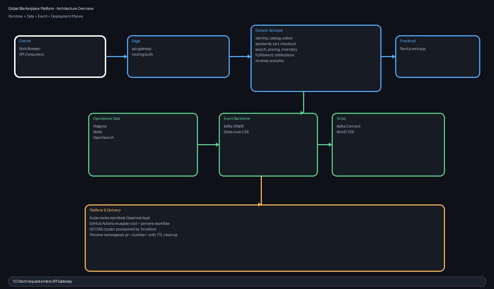

# Global Marketplace Platform Architecture Deep Dive

## What this document gives you

This guide explains how the full codebase works end-to-end:
- runtime architecture
- service responsibilities
- data and event flow
- Kubernetes and infrastructure topology
- CI/CD and preview environment lifecycle
- operational troubleshooting model

An architecture GIF is included below.

---

## 1) System at a glance

The platform is a Kubernetes-first microservice commerce system with three major planes:

1. Request plane  
   `Client/Web -> API Gateway -> Domain Services`

2. Data plane  
   `Domain Services -> Postgres / Redis / OpenSearch`

3. Event plane  
   `Postgres CDC -> Debezium -> Kafka -> Kafka Connect -> MinIO`

Core structure:
- `services/` contains backend domain microservices.
- `frontend/` contains Next.js web application.
- `platform/k8s/` contains base manifests and environment overlays.
- `infra/terraform/` provisions OCI network and OKE.
- `.github/workflows/` orchestrates build, deploy, preview, cleanup.

---

## 2) Service map

### Edge
- **api-gateway**: single ingress API for client routing and composition.

### Domain services
- identity, seller, catalog, search, pricing, inventory, cart, checkout
- payments, orders, fulfillment, notifications, reviews, analytics
- transformer-api (ML inference endpoint)

Each service is deployed independently and exposed internally through ClusterIP services in Kubernetes.

---

## 3) Data and event architecture

### Operational stores
- **Postgres**: primary transactional source of truth.
- **Redis**: low-latency cache and state acceleration.
- **OpenSearch**: search/indexing and read optimization.

### Streaming + CDC
- **Kafka (KRaft)**: event backbone.
- **Debezium connector**: captures Postgres changes and emits CDC streams.
- **Kafka Connect**: consumes stream topics and syncs to object storage.
- **MinIO**: S3-compatible sink for event archive and lake-style export.

### Why this split works
- transactional workloads stay isolated in Postgres.
- search and cache concerns move out of critical write path.
- async event propagation decouples downstream consumers.

---

## 4) Request lifecycle (runtime path)

1. Browser/web calls API Gateway endpoint.
2. API Gateway forwards request to target domain service.
3. Service reads/writes operational data stores.
4. State changes produce CDC records (Debezium).
5. Events stream through Kafka topics.
6. Connect sinks selected topics into MinIO for archive/analytics.

---

## 5) Kubernetes model

`platform/k8s/base` includes:
- namespace + core infrastructure workloads
- all service deployments and services
- bootstrap jobs for topics/connectors/buckets
- configmaps for connector definitions

Environment overlays:
- `platform/k8s/overlays/dev`
- `platform/k8s/overlays/prod`

Overlay duties:
- namespace targeting
- image tag pinning
- replica and environment-specific tuning
- service exposure policy

---

## 6) Infrastructure model (OCI + Terraform)

Terraform module stack provisions:
- VCN and required subnets
- OKE cluster
- OKE node pool sizing/shape/image
- LB subnet mapping

Operational behavior:
- CI deploy workflows target OKE via kubeconfig + OCI fallback generation.
- namespace-scoped preview environments are created per PR.
- stale preview namespaces are auto-cleaned by TTL schedule.

---

## 7) CI/CD architecture

Main workflows:
- reusable pipeline for build/scan/push/deploy
- dev deploy pipeline
- prod canary/promote pipeline
- preview PR pipeline
- stale preview cleanup pipeline

Preview flow:
1. PR to `dev` with `preview` label triggers preview deploy.
2. Namespace `pr-<number>` is created and labeled with TTL metadata.
3. Images are built and deployed with namespace-aware kustomize render.
4. PR comment is updated with preview endpoint details.
5. On PR close, namespace is deleted.
6. Scheduled cleanup removes expired preview namespaces.

---

## 8) Repository operating model

### Local development
- Docker Compose can run full stack for local integration.
- Make targets provide single-command operations for lint/test/deploy tasks.

### Team workflows
- Push to `dev` drives dev deployment.
- Preview label enables ephemeral PR environment.
- Infra controls can run locally or via CI-safe wrapper commands.

---

## 9) Reliability and failure boundaries

Most critical boundaries:
- Kubernetes rollout readiness and dependency sequencing.
- image registry pull availability and credentials.
- cluster endpoint drift and kubeconfig refresh.
- OCI service limits (LB quotas, volume attachment constraints).

Current deployment logic includes:
- rollout diagnostics with pod/event/log context on failure
- preview namespace TTL labels and scheduled cleanup
- namespace-scoped PR deployment isolation
- immutable bootstrap-job reset before apply

---

## 10) Fast troubleshooting guide

If preview deploy is skipped:
- ensure PR targets `dev`
- ensure PR has `preview` label
- ensure PR originates from same repository

If rollout fails:
- inspect rollout diagnostics from workflow output
- inspect namespace events and pod states
- check service quotas and registry limits

If endpoint is pending:
- API/Web LB exposure may be quota-limited or intentionally internal for preview mode
- use service inspection and, if needed, port-forward for internal web verification

---

## 11) Reading order for new engineers

1. `README.md`
2. `docs/README.md`
3. `platform/k8s/base/kustomization.yaml`
4. `platform/k8s/overlays/dev/kustomization.yaml`
5. `.github/workflows/preview-pr.yml`
6. `.github/workflows/reusable-cicd.yml`
7. `infra/terraform/envs/dev/main.tf`
8. `infra/terraform/modules/oke/main.tf`

This gives a full understanding from runtime behavior to deployment control plane.
